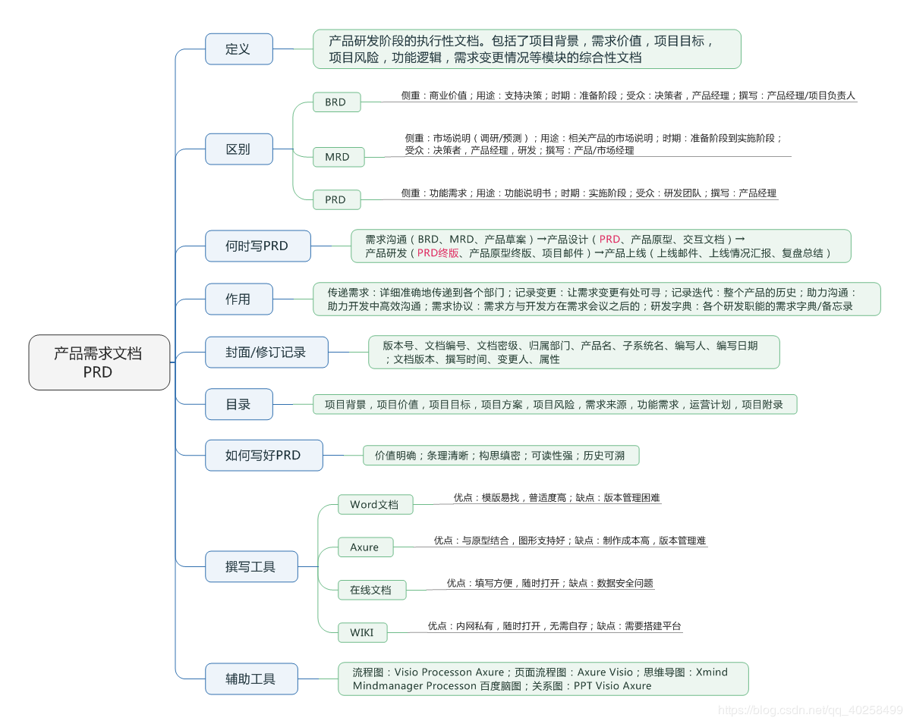
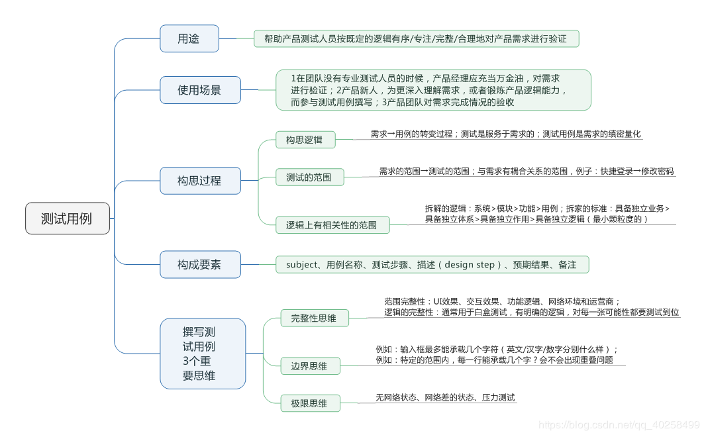
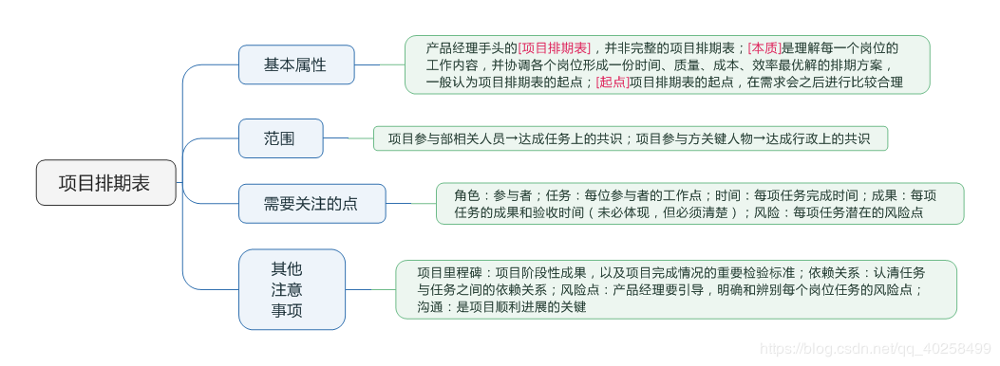
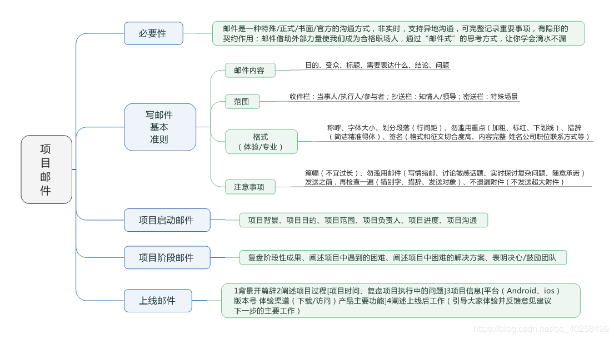

# 产品经理必备7大文档

## 第一个是产品体验报告

[01](./images/01.png)

## 竞品分析报告

[02](./images/02.png)

竞品分析参考资料

<table>
  <thead>
    <tr>
      <th>类型</th>
      <th>名称</th>
      <th>备注</th>
    </tr>
  </thead>
<tbody>
<tr>
<td>综合类</td>
<td>艾瑞、易观、talkingdata、trustdata、CNNIC、DCCI</td>
<td>行业数据</td>
</tr>
<tr>
<td>软件商店</td>
<td>AppStore、应用宝、百度、豌豆荚、360、华为、小米</td>
<td>下载排行、用户评价</td>
</tr>
<tr>
<td>指数类</td>
<td>艾瑞指数、百度指数、微信指数、微指数、360指数、友盟指数、阿里指数、淘宝指数</td>
<td>趋势</td>
</tr>
<tr>
<td>排名类</td>
<td>移动观象台、七麦数据、app annie、站长之家、Alexa</td>
<td>APP排行、用户画像</td>
</tr>
<tr>
<td>行业/专业</td>
<td>人人都是产品经理、知乎、36氪、IT橘子、虎嗅、创业邦</td>
<td>专业文章、行业新闻</td>
</tr>
</tbody>
</table>

## 需求池

它包括需求池和需求模版。需求池需要产品经理每天维护，而需求模版是给运营部门、客服等提需求者写的

[03](./images/03.png)

## 产品需求文档（Product Requirement Document，PRD）

## 测试用例

## 项目排期表

## 项目邮件

在产品立项、设计、进行中会经常用到文档,面向技术、运营、市场等部门同事，要写多种需求文档让他们配合执行，是执行的依据和高效工具。
商业需求文档BRD
BRD是英文”Business Requirement Document“的缩写，根据英文直译过来就是”商业需求文档“的意思，指的就是基于商业目标或价值所描述的产品需求内容文档（报              告），其核心的用途就是用于产品在投入研发之前，由企业高层作为决策评估的重要依据。
市场需求文档MRD
分析产品在市场中的定位，有哪些机会、风险、优势和劣势（swot），竞争对手分析，合作对象分析，策划产品应该如何发展、宣传、合作等。
用户需求文档URD
分析产品的用户人群定位，用户特点和行为习惯，划分需求类型：基础需求，深层次需求，高端增值需求，需求转换途径和方法等(UCD)。策划产品以用户需求为中心。
产品需求文档PRD
结合mrd的竞争对手分析，urd的用户定位和需求，策划产品的结构、功能，有哪些前端界面或后台，需要的开发项和实现方式等。做Test Case，操作场景和方式的测试用例。
运营需求文档ORD
结合prd中的产品界面和功能设置，描述产品如何使用，发布后台如何操作。策划出哪些是需要人为运营的，需要编辑发的内容。
数据需求文档SRD
结合urd的用户行为和prd的功能，策划哪些是需要数据统计的，分析用户的访问和点击效果，功能使用效果，流量和用户量变化，运营和宣传的效果等。
商业需求文档BRD
突出产品在市场的发展，用户的定位，产品的功能、数据、运营方式的特点，策划销售方式，广告位，卖点、服务、报价等;
产品经理的工作中会经常开会，需要写上面的文档，产品经理的工作内容在大公司也会有区别，也可能成为多个职位分别负责，例如产品调研专员、交互设计师等。但是产品经理发展，按级别晋升是。：产品专员、产品初级经理、中级经理、高级经理、资深经理、产品主管、产品副总监、产品总监、产品高级总监、产品执行官（部门总监）。希望大家能做好产品和晋升。
